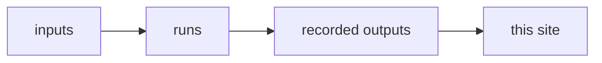

```mermaid
flowchart LR
  IN["inputs"] --> RUN["runs"]
  RUN --> EV["recorded outputs"]
  EV --> SITE["this site"]
```

A result says what a system produced on an input, nothing more. This site
pins site-kit v0.2.0.
